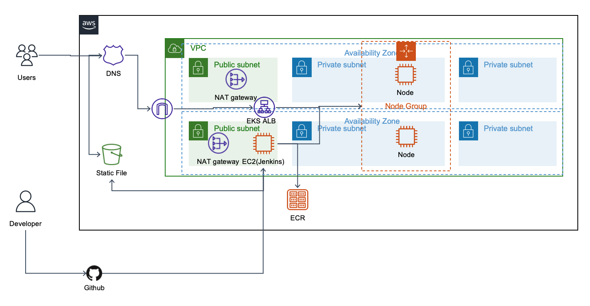

# ldy9037/assignment-python-service

Django + rest_framework로 회원 서비스 구현 

##### 좋은 commit message 작성을 위한 참고자료
- [AngularJS Git Commit Message Conventions](https://docs.google.com/document/d/1QrDFcIiPjSLDn3EL15IJygNPiHORgU1_OOAqWjiDU5Y/edit#heading=h.uyo6cb12dt6w)

## Table of Contents

- [소개](#소개)
- [시스템구성도](#시스템구성도)
- [Terraform](#Terraform)
- [모니터링](#모니터링)
- [어플리케이션](#어플리케이션)
- [제작자](#제작자)

## 소개

 K8s 기반의 어플리케이션입니다. 과제 내용은 언급할 수 없어 생략합니다. 

 Task 관리는 Notion을 사용
 - [Notion Link](https://emadam.notion.site/18c0990d85b54b149290b6db7bfe94d0?v=a5ff4815117f4b1eb399354cd5545cb5)
 
## 시스템구성도
구성되어 있는 Cloud 아키텍처 다이어그램입니다.  
(구성된 것만 포함하였습니다.)

### Public Cloud
Public Cloud로 AWS를 채택했습니다. 간단한 웹어플리케이션을 배포할 것이기 때문에 HTML/CSS/JS와 같은 정적 콘텐츠를 배포하기 위한 S3를 구성하였고 Jenkins를 구성하기 위해 단일 EC2를 Public Subnet에 구성하였습니다. 여기에 백엔드 구성을 위한 EKS와 Container Repository인 ECR을 구성하였습니다. 

### 쿠버네티스
쿠버네티스는 AWS EKS를 사용했습니다. Cluster와 노드 그룹에 AWS 서비스에 액세스 가능하도록 적절한 Role을 구성해 지정하였고 노드 내 파드를 외부에 노출 시키기 위해 Application Loadbalancer Controller를 구성한 뒤 AWS ALB 서비스에 액세스 가능하도록 Service Account와 Role을 구성하였습니다. 그 다음 ALB를 구성한 뒤 Service와 연결해 직접 구현한 백엔드 API를 외부로 노출시켰습니다. 

### CI/CD 
CI/CD로 Jenkins를 사용하였습니다. S3와 EKS Cluster, ECR에 접근해야하기 때문에 S3에 배포할 수 있는 권한과, ECR에 Push할 수 있는 권한, Cluster 정보를 가져올 수 있는 권한이 포함된 IAM 계정을 사용하였으며 해당 IAM 계정으로 Cluster에 매니페스트를 반영하기 위해 cluster RBAC로 적절한 권한을 부여했습니다. 

## Terraform
infra 디렉토리의 README.md에 상세하게 적어두었습니다. 

## 모니터링
매트릭은 CloudWatch를 사용해 대시보드를 구성하였고, 액세스 로그는 CloudTrail을 사용하였습니다. 알림은 SNS/Chatbot/Slack으로 구성하였습니다. 

## 어플리케이션
프론트와 백엔드가 분리되어 있으며 프론트가 백엔드와 통신하지는 않습니다.(CI/CD만 구성) 프론트엔드는 /webapp에 구성되어 있고 백엔드는 /api에 구성되어 있으며, 각 디렉토리의 README.md에 어플리케이션 설명을 기입해두었습니다. 

## 제작자
[ldy9037@naver.com](ldy9037@naver.com)
