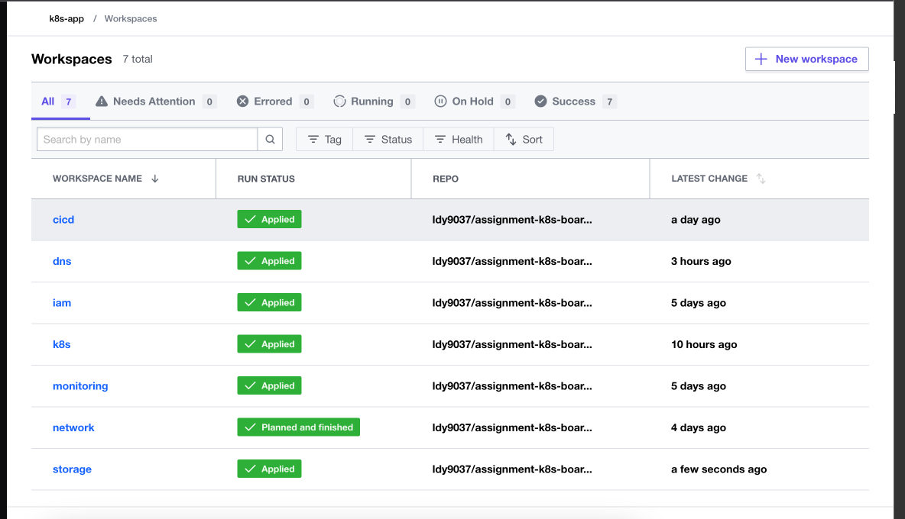

# ldy9037/assignment-k8s-board

## Table of Contents

- [소개](#소개)
- [시작하기](#시작하기)
- [구성요소](#구성요소)
- [제작자](#제작자)

## 소개

  과제전형 중 Public Cloud/k8s 기반의 인프라 구성을 위한 Terraform 구성 디렉토리입니다. 

  현재 디렉토리에 구성된 인프라 리소스들은 크게 3가지로 나눌 수 있습니다. 
  
  ### backend
  tfe Provider로 구성한 Terraform Cloud 리소스의 state를 관리하기 위한 s3 remote backend 구성입니다.

  ### workspace
  실제 AWS 리소스들의 state를 관리하게 되는 Terraform Cloud 구성입니다. Organization부터 도메인 별 리소스들을 workspace 단위로 묶어두었으며, Github와 연동해 각 도메인에 해당하는 working directory에 반응하도록 설정하였습니다. 
  
  ### aws_*
  연관된 리소스끼리 묶여있는 AWS 리소스 디렉토리입니다. 이번 과제는 단일 환경으로 구성하였기 때문에 디렉토리에 환경 구분은 없으며, 서비스 단위로 묶지 않고 주요 리소스 단위로 묶어서 구분하였고 대부분 AWS Module을 사용해 리소스를 생성하였습니다. 
  
 
 ##### 기술 스택
 - terraform v1.1.7
 - terraform cloud
 - [aws provider](https://registry.terraform.io/providers/hashicorp/aws/latest/docs)
 - [aws module](https://registry.terraform.io/namespaces/terraform-aws-modules)

## 구성요소
Terraform으로 구성한 전체 AWS 리소스 목록입니다. 
- Remote Backend 용 S3 버킷과 state 접근 기록 로깅 용 S3 
- Terraform Cloud Organization
- Terraform Cloud Slack Notification
- Terraform Cloud workspace
- IAM 기본 사용자
- CloudTrail 감사로깅 / Chatbot + SNS Slack Notification
- Network (VPC, Subnet, IGW, RoutingTable, NAT 등)
- Route53 Hostzone, record
- Jenkiins 용 EC2 + IAM
- 웹사이트 호스팅 용 S3 + IAM
- 백엔드 구성 용 EKS Cluster + Node group + IAM

## 제작자
[ldy9037@naver.com](ldy9037@naver.com)